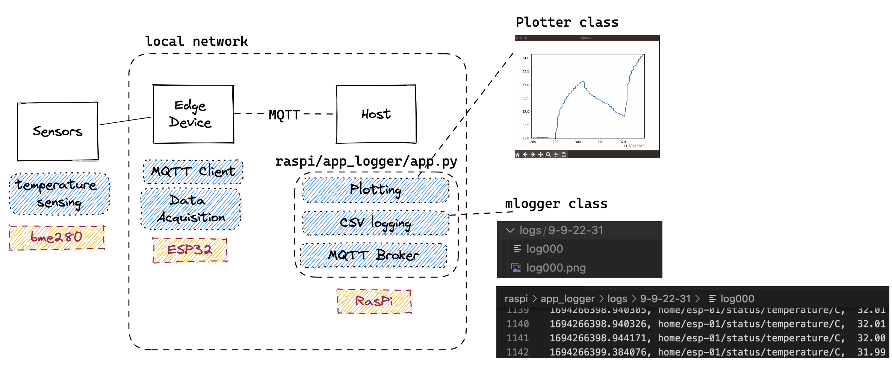

Real time data logging to csv and concurrent plotting with matplotlib, creating an mqtt client to listen to the specified topic on a specified mqtt broker/host. 



Logger is under `raspi/app_logger/app.py`. For example: 
```sh
python raspi/app_logger/app.py -t # -d -h 192.168.0.17 -g 
```
> i.e. "all topics ("#"), for mqtt broker on host 192.168.0.17, include plotting (-g)

Seperate threads and callbacks are made for plotting and writing to the datafile
- `log_worker` empties the data-to-log queue every 2 seconds
- `plotter.update` is the `matplotlib.animate.funcanimation` function that updates the graph every provided `interval` (also has a queue to process data)

Example Video:


## Setting Up the ESP32 sensor

A BME temperature sensor is used over Two-Wire/I2C

## Setting up the RasPi/MQTT Broker

**On local machine**:
```
# use SSH from a terminal to get into the Pi server
ssh pi@raspberrypi.local 
# ... enter user/pass ...
```

**In a server terminal (or after SSHing in)**:
```
# print IP address (should match the one in `secrets.h`)
hostname -I 
# ...
# check the `mosquitto` status:
systemctl status mosquitto.service 
# ... if status is running try:
mosquitto_pub -d -t inTopic -m "ON" 
# which should turn the builtin on the ESP32 ON if it is OFF
```

> If necessary restart the mosquitto service with
`sudo systemctl restart mosquitto`

> If we want to see the `outTopic` responses from the ESP32 we can open up another terminal on the MQTT broker and subscripe to this topic e.g.
`mosquitto_sub -d -t outTopic`
> Or to subscribe to all topics do:
`mosquitto_sub -d -t "#"`

**Notes/Gotchas**
- the mosquitto broker has to be configured to accept anonymous connections (disabled by default)
- put the ESP32 in "flash" mode by (1) pressing and holding BOOT (2) pressing and releasing ENABLE (3) releasing BOOT
